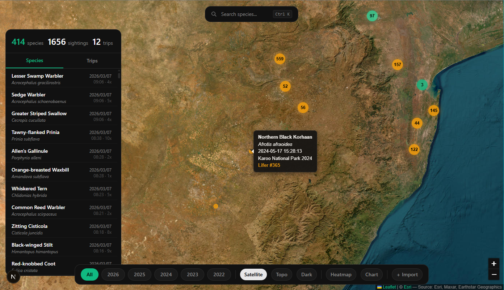

# BirdLasser Social

A dark, map-first web app for visualizing your [BirdLasser](https://www.birdlasser.com/) bird sighting data. Import your trip card CSVs and explore your life list on an interactive map with heatmaps, marker clustering, lifer tracking, and cumulative species charts.

BirdLasser only exports one trip at a time as CSV — this tool lets you import multiple trips, deduplicate sightings, and see everything together in one place.

<p align="center">
  
</p>

## Features

- **Full-screen map** with satellite, topo, and dark tile layers
- **Marker clustering** with spiderfy for small clusters and zoom for large ones
- **Lifer markers** — first-ever sightings highlighted in gold, with lifer number in tooltip
- **Heatmap overlay** to visualize sighting density
- **Cumulative life list chart** showing species growth over time
- **Side panel** with virtualized species and trip lists
- **Command palette** (Ctrl+K) for quick species search and actions
- **Multi-file CSV import** with automatic duplicate detection
- **All data stays in your browser** (IndexedDB) — nothing is sent to a server

## Getting Started

### Prerequisites

- Node.js 18+

### Install & Run

```bash
cd app
npm install
npm run dev
```

Open [http://localhost:3000](http://localhost:3000) in your browser.

### How to Use

1. Open BirdLasser on your phone
2. Go to **Trip Cards**
3. Click on the **...** icon next to a trip card
4. Select **Export CSV trip card**
5. Email it to yourself and download it on your computer
6. Upload one or more CSV files on the import screen

You can upload multiple trips at once. Duplicates are automatically skipped.

## Tech Stack

| Component | Choice |
|-----------|--------|
| Framework | Next.js (App Router, TypeScript) |
| Maps | Leaflet.js + leaflet.markercluster + leaflet.heat |
| Charts | Chart.js + chartjs-adapter-date-fns |
| Styling | Tailwind CSS |
| Storage | IndexedDB (via idb) |
| CSV Parsing | PapaParse |
| Command Palette | cmdk |
| Virtualization | @tanstack/react-virtual |

## Project Structure

```
app/src/
├── app/
│   ├── layout.tsx          # Root layout, dark theme, fonts
│   ├── page.tsx            # Main single-page app
│   └── globals.css         # Dark scrollbars, Leaflet overrides
├── components/
│   ├── MapView.tsx         # Full-screen Leaflet map with clustering
│   ├── SidePanel.tsx       # Species & trip lists (virtualized)
│   ├── CumulativeChart.tsx # Life list growth chart
│   ├── CommandPalette.tsx  # Ctrl+K search
│   ├── ImportView.tsx      # CSV upload with instructions
│   ├── FloatingPanel.tsx   # Reusable dark card
│   └── PillFilters.tsx     # Year/style filter pills
├── data/
│   ├── index.ts            # Data aggregation functions
│   └── types.ts            # TypeScript interfaces
└── lib/
    ├── db.ts               # IndexedDB storage
    └── csv-parser.ts       # BirdLasser CSV parsing
```

## License

Open source. Built as a personal hobby project.
